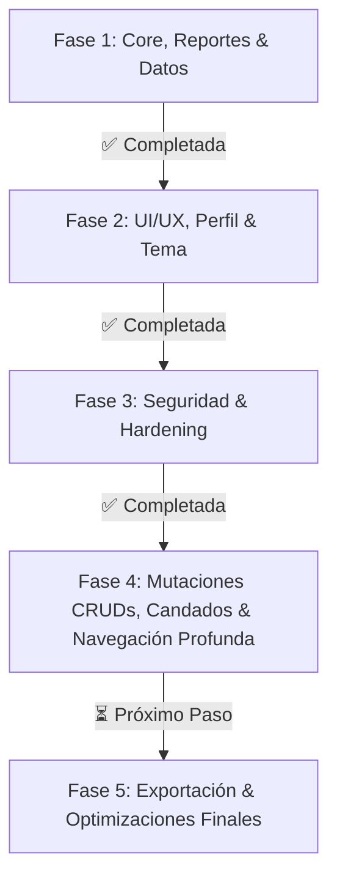

# Requerimientos — Proyecto Vino Nuevo

## Descripción General
Aplicación web de gestión y reportes para un servicio comunitario (ministerio "Vino Nuevo").  
**Stack:** Python Flask + MySQL (PyMySQL) + HTML/CSS/JS (Jinja2)  
**Cobertura y Calidad:** 236 pruebas automatizadas ejecutadas y pasando al 100% (`unittest`).

---

## 1. Estado General de Requerimientos

**Criterio de Evaluación:** Se considera **Implementado (✅)** lo que está conectado a una ruta, servicio, consulta o listener funcional con persistencia en BD y validado por pruebas automatizadas. Lo que cuenta con backend funcional pero le faltan mutaciones o frontend se cataloga como **Parcial (⚠️)**. Lo que no tiene desarrollo se cataloga como **Pendiente (❌)**.

| # | Requerimiento | Estado actual | Evidencia y Trabajo Pendiente |
|---|---|---|---|
| 1 | **INSERT y Guardado de Reportes en BD** | ✅ Implementado | `services/cdp_service.py:process_reporte()` y `db_queries.insertar_reporte()`. Formulario conectado en `POST /lider_cdp/generar_reporte`, con UUID(), invalidación de caché, soporte de ofrendas duales (USD/Bs), cálculo dinámico desacoplado (`generar_reporte.js`), idempotencia de envío (`form_guard.js`) y control transaccional con rollback. |
| 2 | **Edición y Eliminación de Reportes (Líder CDP)** | ✅ Implementado | Modales funcionales en `index.html` con endpoints `POST /lider_cdp/reporte/<id>/editar` y `POST /lider_cdp/reporte/<id>/eliminar`, control de permisos por CDP, validación anti-IDOR de `cdp_id` y confirmación. |
| 3 | **Script de Poblado y Test Data** | ✅ Implementado | `insert_test_data.py` con soporte para SSL en BD remota (Aiven/Cloud), dotenv, generación de UUIDs, hashes Werkzeug y 8 semanas de reportes históricos e idempotencia. Script de saneamiento `scripts/cleanup_duplicate_reports.py`. |
| 4 | **Dashboard con Datos Reales, Períodos Dinámicos (Semana/Mes/Año) y Gráficos Interactivos** | ✅ Cumplido | `dashboard_service.py`, `db_queries.py` y `mock_data.py` con métricas jerárquicas (General, Red, CDP) y selector interactivo de períodos (**Semana / Mes / Año**). Adaptación dinámica de títulos, ranking de redes con porcentajes de eficiencia, tooltips con rangos de fechas (`rango_fecha`), scroll horizontal adaptativo para series extensas (> 7 puntos), estados vacíos y caché en memoria compuesta con invalidación inteligente (`tests/test_dashboard_metrics.py`). |
| 5 | **Filtros de Reportes (Admin & Supervisor)** | ✅ Implementado | Búsqueda por texto libre, red, Casa de Paz y rango de fechas (`fecha_desde`, `fecha_hasta`) en vistas de administración y supervisión regional. |
| 6 | **Paginación Real Server-Side** | ✅ Implementado | Paginación con ventana deslizante (±2 páginas) y puntos suspensivos en **Reportes**, **Usuarios**, **Líderes** y en el historial del **Dashboard de Líder CDP**. |
| 7 | **Vistas de Supervisor Aisladas por Red y Protección de API** | ✅ Implementado | Dashboard, Estructura, Reportes y Directorio de Líderes con filtrado y aislamiento estricto por la red asignada al supervisor. Endpoint `/api/dashboard/datos` con validación estricta que impide consultas fuera de la red del supervisor (403 Forbidden / Anti-IDOR). |
| 8 | **Vista de Detalle de Casa de Paz y Blindaje de Fallbacks** | ✅ Implementado | Rutas `/admin/casa_de_paz/<id>` y `/supervisor/casa_de_paz/<id>` con `detalles_cdp.html`. Muestra cuenta de usuario del sistema (`@username`), botón de gestión directa de credenciales, teléfono propio de la casa con llamadas y WhatsApp directo, equipo ministerial y badge dinámico de cumplimiento semanal (7 días). Blindaje de consultas para evitar filtración de datos mock en producción. |
| 9 | **Navegación Profunda y Filtros URL en Estructura** | ✅ Implementado | Soporte de parámetros URL (`red_id`, `cdp_id`, `filtro`, `q`) en `/admin/estructura` y `/supervisor/estructura`. Selección automática de red, scroll suave y resaltado visual enfocado en la Casa de Paz seleccionada desde el Dashboard u otras vistas (`tests/test_estructura_url_filters.py`). |
| 10 | **Módulo de Perfil y Credenciales** | ✅ Implementado | Perfil unificado en Admin, Supervisor y Líder CDP con cambio de nombre de usuario, cambio de contraseña con verificación de clave actual, indicador de fortaleza y hash Werkzeug. Cobertura en `tests/test_perfil.py`. |
| 11 | **Conectividad Resiliente con Circuit Breaker, Scoped Connection & Pool Persistente** | ✅ Implementado | `database.py` con `_RequestScopedConnection` y pool persistente de conexiones reutilizables (`queue.LifoQueue`), circuit breaker con reintentos configurables, drenado de sockets en reset y limpieza en `teardown_appcontext`. Fallback transparente a modo demo cuando la base de datos externa no está disponible y `MOCK_MODE=True`. Soporte de bypass en testing con `DISABLE_CACHE`. |
| 12 | **Modo Oscuro Global** | ✅ Implementado | Variable `data-theme="dark"`, persistencia en `localStorage`, inicializador centralizado anti-FOUC (`theme_init.js`) y selectores de tema accesibles en login y perfil. |
| 13 | **Flash Messages y Notificaciones Toast** | ✅ Implementado | Script desacoplado `static/scripts/toast.js` con auto-dismiss (5s), animación de desvanecimiento, categorías semánticas (`success`, `danger`, `warning`, `info`) e iconos contextuales en `admin_layout.html` y `admin_form_layout.html`. |
| 14 | **Páginas de Error Personalizadas** | ✅ Implementado | Plantillas de error 400, 403, 404, 429 (Rate Limit excedido) y 500 (Error interno) estilizadas bajo el design system, con soporte de modo oscuro y botones de retorno contextual. |
| 15 | **CRUD de Usuarios Completo y Candados de Eliminación** | ✅ Implementado | Rutas `POST /admin/usuario/crear`, `POST /admin/usuario/<id>/editar`, `POST /admin/usuario/<id>/toggle_estado` y `POST /admin/usuario/<id>/eliminar`. Validación backend estricta, hashes Werkzeug, modales de confirmación (`usuarios.js`, `form_usuario.js`) y **Candados de Eliminación Segura** (`tests/test_usuario_delete_guards.py`): impide eliminar usuarios que supervisen redes o lideren CDPs activas. |
| 16 | **CRUD de Casas de Paz (Mutaciones POST y Baja Defensiva)** | ✅ Implementado | Rutas `POST /admin/casa_de_paz/crear`, `POST /admin/casa_de_paz/<id>/editar`, `POST /admin/casa_de_paz/<id>/toggle_estado` y `POST /admin/casa_de_paz/<id>/eliminar` conectadas (`tests/test_cdp_crud.py`). Creación dual (usuario nuevo o existente), edición completa y baja defensiva (bloquea si tiene líderes, aplica soft-delete si tiene reportes, o eliminación física limpia si no tiene dependencias). |
| 17 | **CRUD de Redes (Mutaciones POST y Estado)** | ✅ Implementado | Rutas `POST /admin/red/crear`, `/admin/red/<id>/editar`, `/admin/red/<id>/toggle_estado` y `/admin/red/<id>/eliminar` conectadas y funcionales (`tests/test_red_toggle_estado.py`). Asignación/desvinculación de supervisor, alternancia activa/pausada con insignias dinámicas, invalidación de caché y eliminación protegida sin huérfanos. |
| 18 | **CRUD de Líderes Completo y Candados de Eliminación** | ✅ Implementado | Rutas `POST /admin/lider/crear`, `POST /admin/lider/<id>/editar`, `POST /admin/lider/<id>/toggle_estado` y `POST /admin/lider/<id>/eliminar`. Asignación y cambio de Casa de Paz, validación de teléfonos y **Candados de Eliminación Segura** (`tests/test_lider_delete_guards.py`): bloquea eliminación permanente si el líder tiene reportes históricos enviados para preservar la auditoría ministerial. |
| 19 | **Gestión Jerárquica de Estado y Cascada de Reactivación** | ✅ Implementado | Lógica de estado interconectada (`tests/test_reactivacion_estado.py` y `test_supervisor_and_cascading.py`): pausar una red o CDP propaga el estado de inactividad correspondiente y reactivar valida la disponibilidad y jerarquía superior. |
| 20 | **Seguridad en Login con Google reCAPTCHA v2 / v3 y Anti-Open Redirect** | ✅ Implementado | Integración de reCAPTCHA en `routes/auth_routes.py`, `config.py` y `static/scripts/login.js`. Sanitización estricta de redirecciones posteriores al login con `get_safe_redirect_url()` para prevenir vulnerabilidades de Open Redirect (`tests/test_security_remediations.py`). |
| 21 | **Monitoreo de Cumplimiento Semanal de Reportes (7 días)** | ✅ Implementado | `check_cdp_reporte_7d()` y `get_casas_sin_reporte_7d()`. Banner interactivo en Estructura con contador dinámico por red seleccionada, botón de filtro rápido ("Ver pendientes" / "Ver todas"), badges de alerta y modales informativos. |
| 22 | **Idempotencia, Accesibilidad de Formularios y Retención de Datos** | ✅ Implementado | `static/scripts/form_guard.js` implementado en todos los layouts: prevención de doble envío (`test_form_idempotency.py`), toggle accesible de contraseñas por teclado (`Enter`/`Espacio`) con atributos ARIA en formularios de Usuario y CDP (`form_cdp.html`, `form_usuario.html`), y retención de valores (`form_data`) con fecha por defecto ante fallos de validación en reportes (`generar_reporte.html`). |
| 23 | **Endurecimiento de Configuración de Producción (Fail-Fast)** | ✅ Implementado | `ProductionConfig.validate_production_environment()` en `config.py`: aborta el arranque si faltan variables críticas de BD, si `SECRET_KEY` es la default, o si `DEBUG=True` / `MOCK_MODE=True` en producción (`tests/test_production_config.py`). |
| 24 | **Modularización de Scripts JS y Desacoplamiento CSP** | ✅ Implementado | Extracción de scripts inline a módulos externos en `static/scripts/`: `theme_init.js`, `toast.js`, `login.js`, `generar_reporte.js`, `dashboard.js`, `form_guard.js`, `admin/form_cdp.js`, `admin/form_redes.js`, `admin/form_usuario.js` y `admin/lider.js`. |
| 25 | **Búsqueda Client-Side en Tiempo Real** | ⚠️ Parcial | **Completado en la vista de Estructura** (`static/scripts/estructura.js`): Búsqueda instantánea en vivo por código, líder, anfitrión y zona en `#casasSearchInput` sin recarga. <br>**Falta:** Extender el filtrado instantáneo en vivo (live search client-side) a las tablas de Usuarios y Líderes. |
| 26 | **Integración de Contacto por WhatsApp** | ⚠️ Parcial | Enlaces `wa.me` generados con compatibilidad en detalles de CDP, directorio de líderes y tarjetas de estructura. <br>**Falta:** Normalización estricta de códigos telefónicos internacionales (E.164) en todos los formularios de edición restantes. |
| 27 | **Exportación a PDF y Excel** | ❌ Pendiente | Botones visuales maquetados en reportes y listados. <br>**Falta:** Implementar endpoints con descarga física en PDF (reportes consolidados con resumen de asistencia y ofrendas) y Excel (`.xlsx` o `.csv`) para reportes, usuarios, líderes y CDPs con filtros aplicados. |

---

## 2. Diagnóstico de Seguridad y Hardening

### 2.1 Estado de Controles de Seguridad

| # | Área de Seguridad | Estado | Nivel de Riesgo | Detalle Técnico |
|---|---|---|---|---|
| 1 | **Protección CSRF** | ✅ **Protegido** | **Bajo** | `Flask-WTF` activo con `CSRFProtect(app)` y tokens `{{ csrf_token() }}` inyectados en todos los formularios, modales POST y llamadas dinámicas. |
| 2 | **Rate Limiting en Autenticación** | ✅ **Protegido** | **Bajo** | `Flask-Limiter` activo limitando intentos en `POST /iniciar_sesion` (5 intentos por minuto) y límites globales anti-DoS, con plantilla de error personalizada `429.html`. |
| 3 | **Google reCAPTCHA en Login** | ✅ **Protegido** | **Bajo** | Verificación anti-bot con Google reCAPTCHA v2 / v3 en login (`RECAPTCHA_SITE_KEY`, `RECAPTCHA_SECRET_KEY`) con verificación server-side. |
| 4 | **Prevención de Open Redirect** | ✅ **Protegido** | **Bajo** | Sanitización de parámetro `next` mediante `utils/auth.py:get_safe_redirect_url()`, restringiendo destinos exclusivamente al mismo host. |
| 5 | **Protección Anti-IDOR y Aislamiento Territorial** | ✅ **Protegido** | **Bajo** | Rutas de supervisor (`/supervisor/...`) y API (`/api/dashboard/datos`) bloquean con `403 Forbidden` el acceso a redes o CDPs fuera de su territorio asignado. |
| 6 | **Cabeceras de Seguridad HTTP** | ✅ **Protegido** | **Bajo** | Inyección global en `after_request`: `X-Frame-Options: SAMEORIGIN`, `X-Content-Type-Options: nosniff`, `Content-Security-Policy` (CSP compatible con fonts y recaptcha), `Referrer-Policy` y `Permissions-Policy`. |
| 7 | **Hardening de Cookies de Sesión** | ✅ **Protegido** | **Bajo** | `SESSION_COOKIE_HTTPONLY=True`, `SESSION_COOKIE_SAMESITE='Lax'`, `SESSION_COOKIE_SECURE` y `PERMANENT_SESSION_LIFETIME=timedelta(hours=2)`. |
| 8 | **Validación y Sanitización Server-Side** | ✅ **Protegido** | **Bajo** | Módulo centralizado `utils/validators.py`: validación de tipos, rangos numéricos, coherencia horaria, teléfonos con formato E.164 y sanitización XSS (`markupsafe.escape`). |
| 9 | **Política de Complejidad de Contraseñas** | ✅ **Protegido** | **Bajo** | `validate_password_strength` exige mínimo 8 caracteres, al menos una mayúscula, una minúscula y un número en creación/edición de usuarios y CDPs. |
| 10 | **Gestión de Sesión en Logout & Fixation** | ✅ **Protegido** | **Bajo** | `session.clear()` en logout y regeneración/limpieza previa de sesión en login para neutralizar fijación de sesión. |
| 11 | **Hasheo de Contraseñas** | ✅ **Protegido** | **Bajo** | Implementado con Werkzeug `generate_password_hash` (`pbkdf2:sha256`), verificación segura y migración automática transparente de claves legacy. |
| 12 | **Inyección SQL** | ✅ **Protegido** | **Bajo** | Todas las consultas en `db_queries.py` y servicios utilizan consultas parametrizadas `%s` con tuplas. |
| 13 | **Control de Acceso Basado en Roles (RBAC)** | ✅ **Protegido** | **Bajo** | Decoradores `@login_required`, `@role_required("admin", "supervisor", "lider_cdp")` y validación de pertenencia territorial activa en vistas y API. |
| 14 | **Validación Fail-Fast en Producción** | ✅ **Protegido** | **Bajo** | Validación automática al iniciar la app en entorno productivo; impide despliegues con configuraciones inseguras. |
| 15 | **Desacoplamiento de Scripts JS (CSP Compliance)** | ✅ **Protegido** | **Bajo** | Eliminación de scripts JavaScript inline en layouts y templates, reduciendo la superficie de ataque XSS y habilitando directivas CSP estrictas sin `unsafe-inline`. |
| 16 | **Manejo Centralizado de Errores HTTP** | ✅ **Protegido** | **Bajo** | Handlers dedicados en `app.py` para códigos 400, 403, 404, 429 y 500, evitando divulgación de trazas de error (`stack traces`) al cliente. |

---

## 3. Estado de la Base de Datos (`serv_comunitario`)

El esquema relacional activo y verificado en MySQL:

```sql
-- Tabla: usuario
CREATE TABLE `usuario` (
  `id` char(36) NOT NULL DEFAULT uuid(),
  `username` varchar(30) NOT NULL,
  `password` varchar(255) NOT NULL,
  `tipo_usuario` enum('admin','supervisor','lider_cdp') NOT NULL,
  `is_active` tinyint(1) NOT NULL DEFAULT 1,
  `nombre` varchar(30) NOT NULL,
  `apellido` varchar(30) NOT NULL,
  PRIMARY KEY (`id`),
  UNIQUE KEY `username` (`username`)
) ENGINE=InnoDB DEFAULT CHARSET=utf8mb4 COLLATE=utf8mb4_general_ci;

-- Tabla: red
CREATE TABLE `red` (
  `id` int(11) NOT NULL AUTO_INCREMENT,
  `nombre` varchar(50) NOT NULL,
  `is_active` tinyint(1) NOT NULL DEFAULT 1,
  `supervisor_id` char(36) DEFAULT NULL,
  PRIMARY KEY (`id`),
  UNIQUE KEY `uq_red_supervisor` (`supervisor_id`),
  CONSTRAINT `fk_red_supervisor` FOREIGN KEY (`supervisor_id`) REFERENCES `usuario` (`id`) ON DELETE SET NULL ON UPDATE CASCADE
) ENGINE=InnoDB DEFAULT CHARSET=utf8mb4 COLLATE=utf8mb4_general_ci;

-- Tabla: cdp (Casa de Paz)
CREATE TABLE `cdp` (
  `id` int(11) NOT NULL AUTO_INCREMENT,
  `codigo` varchar(30) NOT NULL,
  `anfitrion` varchar(30) NOT NULL,
  `telefono` varchar(15) DEFAULT NULL,
  `direccion` varchar(100) NOT NULL,
  `is_active` tinyint(1) NOT NULL DEFAULT 1,
  `red_id` int(11) NOT NULL,
  `usuario_id` char(36) DEFAULT NULL,
  PRIMARY KEY (`id`),
  UNIQUE KEY `codigo` (`codigo`),
  UNIQUE KEY `usuario_id` (`usuario_id`),
  KEY `fk_cdp_red` (`red_id`),
  CONSTRAINT `fk_cdp_red` FOREIGN KEY (`red_id`) REFERENCES `red` (`id`) ON UPDATE CASCADE,
  CONSTRAINT `fk_cdp_usuario` FOREIGN KEY (`usuario_id`) REFERENCES `usuario` (`id`) ON DELETE SET NULL ON UPDATE CASCADE
) ENGINE=InnoDB DEFAULT CHARSET=utf8mb4 COLLATE=utf8mb4_general_ci;

-- Tabla: lider
CREATE TABLE `lider` (
  `id` int(11) NOT NULL AUTO_INCREMENT,
  `nombre` varchar(30) NOT NULL,
  `apellido` varchar(30) NOT NULL,
  `rol` enum('Lider','Sublider') NOT NULL,
  `telefono` varchar(15) DEFAULT NULL,
  `is_active` tinyint(1) NOT NULL DEFAULT 1,
  `cdp_id` int(11) NOT NULL,
  PRIMARY KEY (`id`),
  KEY `fk_lider_cdp` (`cdp_id`),
  CONSTRAINT `fk_lider_cdp` FOREIGN KEY (`cdp_id`) REFERENCES `cdp` (`id`) ON DELETE CASCADE ON UPDATE CASCADE
) ENGINE=InnoDB DEFAULT CHARSET=utf8mb4 COLLATE=utf8mb4_general_ci;

-- Tabla: reporte
CREATE TABLE `reporte` (
  `id` char(36) NOT NULL DEFAULT uuid(),
  `nro_niños` int(11) NOT NULL DEFAULT 0,
  `nro_regulares` int(11) NOT NULL DEFAULT 0,
  `nro_visitas` int(11) NOT NULL DEFAULT 0,
  `nro_comprometidos` int(11) NOT NULL DEFAULT 0,
  `reconciliaciones` int(11) NOT NULL DEFAULT 0,
  `confesiones` int(11) NOT NULL DEFAULT 0,
  `cesta_amor` tinyint(1) DEFAULT 0,
  `fecha` date DEFAULT curdate(),
  `hr_inicio` time NOT NULL,
  `hr_fin` time NOT NULL,
  `tema` varchar(100) NOT NULL,
  `observaciones` text DEFAULT NULL,
  `ofrendas_usd` decimal(10,2) NOT NULL DEFAULT 0.00,
  `ofrendas_bs` decimal(10,2) NOT NULL DEFAULT 0.00,
  `cdp_id` int(11) NOT NULL,
  `enviado_por_lider_id` int(11) DEFAULT NULL,
  PRIMARY KEY (`id`),
  UNIQUE KEY `uq_cdp_fecha` (`cdp_id`, `fecha`),
  KEY `fk_reporte_cdp` (`cdp_id`),
  KEY `fk_reporte_lider` (`enviado_por_lider_id`),
  CONSTRAINT `fk_reporte_cdp` FOREIGN KEY (`cdp_id`) REFERENCES `cdp` (`id`) ON DELETE RESTRICT ON UPDATE CASCADE,
  CONSTRAINT `fk_reporte_lider` FOREIGN KEY (`enviado_por_lider_id`) REFERENCES `lider` (`id`) ON DELETE SET NULL ON UPDATE CASCADE
) ENGINE=InnoDB DEFAULT CHARSET=utf8mb4 COLLATE=utf8mb4_general_ci;
```

---

## 4. Priorización y Roadmap de Desarrollo



### ✅ Fase 1 — Núcleo, Reportes y Datos (Completada)
- [x] Conexión centralizada a base de datos con Circuit Breaker, soporte SSL y reutilización por contexto de petición (`_RequestScopedConnection`).
- [x] Conexión completa de la planilla de reportes (`POST /lider_cdp/generar_reporte`) con persistencia en MySQL y soporte de ofrendas duales USD/Bs.
- [x] Gestión de reportes para Líder CDP: listado, modales de edición (`/reporte/<id>/editar`) y eliminación (`/reporte/<id>/eliminar`).
- [x] Script `insert_test_data.py` automatizado con hashes Werkzeug, soporte `.env` y SSL.
- [x] Dashboard dinámico multi-nivel con métricas jerárquicas, tarjetas interactivas y caché con invalidación.
- [x] Directorios de lectura de Usuarios, Líderes y Reportes con filtros combinados y paginación con ventana deslizante.
- [x] Vista detallada de Casa de Paz (`/admin/casa_de_paz/<id>` y `/supervisor/casa_de_paz/<id>`).

### ✅ Fase 2 — UI/UX, Perfil y Tema Oscuro (Completada)
- [x] Autenticación rediseñada con toggle de visibilidad de contraseña y selector de tema.
- [x] Módulo de Perfil para todos los roles con actualización de usuario y cambio de contraseña con validación de clave actual.
- [x] Modo oscuro global mediante CSS variables (`data-theme="dark"`), persistencia y prevención anti-FOUC (`theme_init.js`).
- [x] Toasts y notificaciones contextuales integradas en layouts base con auto-dismiss (`toast.js`).
- [x] Accesibilidad y diseño responsivo optimizado (móviles, tablets y desktop).
- [x] Páginas de error 400, 403, 404, 429 y 500 estilizadas e integradas al sistema visual.

### ✅ Fase 3 — Seguridad y Hardening (Completada)
- [x] **Protección CSRF**: Integración global de `Flask-WTF` con `CSRFProtect(app)` y tokens `{{ csrf_token() }}` en todos los formularios y modales.
- [x] **Rate Limiting**: `Flask-Limiter` activo en login (5 intentos por minuto) y límites globales anti-abuso.
- [x] **Google reCAPTCHA**: Protección anti-bot en login con validación server-side.
- [x] **Protección de API y Anti-IDOR**: `@login_required` y `@role_required` en `/api/dashboard/datos` con aislamiento de red.
- [x] **Prevención de Open Redirect**: Sanitización de parámetro `next` en login (`get_safe_redirect_url()`).
- [x] **Cabeceras de Seguridad HTTP**: CSP, HSTS, `X-Frame-Options: SAMEORIGIN`, `X-Content-Type-Options: nosniff` y `Referrer-Policy`.
- [x] **Hardening de Cookies y Sesiones**: `SESSION_COOKIE_HTTPONLY`, `SESSION_COOKIE_SAMESITE='Lax'`, timeout de sesión y `session.clear()` en logout.
- [x] **Endurecimiento de Producción**: Validación fail-fast en `ProductionConfig` (`validate_production_environment()`).
- [x] **Desacoplamiento CSP**: Eliminación de scripts JS inline en todos los templates.

### ✅ Fase 4 — Mutaciones CRUDs, Candados de Integridad e Idempotencia (Completada)
- [x] **CRUD Completo de Usuarios**: Creación, edición, alternancia de `is_active` y eliminación segura con candados (`test_usuario_delete_guards.py`).
- [x] **CRUD Completo de Casas de Paz**: Creación dual, edición, alternancia activa/pausada y baja defensiva (`test_cdp_crud.py`).
- [x] **CRUD Completo de Redes**: Creación, edición, alternancia activa/pausada y asignación de supervisor (`test_red_toggle_estado.py`).
- [x] **CRUD Completo de Líderes**: Creación, edición, alternancia de estado y eliminación protegida por historial (`test_lider_delete_guards.py`).
- [x] **Gestión Jerárquica de Estado**: Propagación y cascada de activación/pausa entre Redes, CDPs y Líderes (`test_reactivacion_estado.py`).
- [x] **Idempotencia de Formularios**: `form_guard.js` previniendo envíos dobles o repetidos en todos los formularios (`test_form_idempotency.py`).
- [x] **Navegación Profunda en Estructura**: Selección de red por URL, scroll y enfoque a la Casa de Paz seleccionada desde el Dashboard (`test_estructura_url_filters.py`).
- [x] **Monitoreo de Cumplimiento Semanal**: Detección de casas sin reporte en los últimos 7 días con badges y filtros en Estructura.
- [x] **Optimización del Dashboard y Selector Dinámico de Período**: Métricas semanales, mensuales y anuales con toggle dinámico (`semana`, `mes`, `anio`), ranking interactivo de redes, tooltips accesibles con `rango_fecha`, scroll horizontal adaptativo y caché multi-período (`test_dashboard_metrics.py`).
- [x] **Pool Persistente de Conexiones MySQL**: Reutilización segura de conexiones vivas (`LifoQueue`) en `database.py` para mitigar latencia de red SSL/TCP y drenado automático en reset del circuit breaker.
- [x] **Accesibilidad en Formularios y Retención de Datos**: Alternancia de contraseñas por teclado (Enter/Espacio) con atributos ARIA y preservación de campos (`form_data`) con fecha por defecto en la generación de reportes.

### ⏳ Fase 5 — Exportación y Optimizaciones Finales (Próximo Paso)
- [ ] **Generación de Reportes PDF/Excel**:
  - Exportación de reportes filtrados a PDF con resumen de asistencia y ofrendas.
  - Exportación de listados de usuarios, líderes y Casas de Paz a Excel (`.xlsx` o `.csv`).
- [ ] **Búsqueda Instantánea Client-Side (Live Search)**:
  - Extender el buscador instantáneo en vivo sin recargar página (como en Estructura) a las tablas de Usuarios y Líderes.
- [ ] **Normalización Telefónica WhatsApp**:
  - Validar y formatear prefijo de país internacional (E.164) en todos los formularios para enlaces directos `wa.me`.
- [ ] **Despliegue y Verificación en Servidor de Producción**:
  - Verificación final de arranque con `ProductionConfig` y ejecución en servidor de despliegue.
