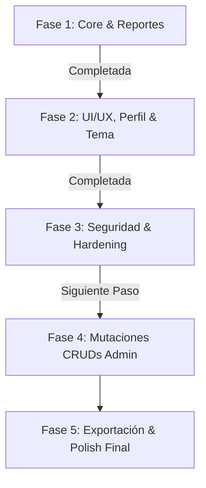

# Requerimientos — Proyecto Vino Nuevo

## Descripción General
Aplicación web de gestión y reportes para un servicio comunitario (ministerio "Vino Nuevo").  
**Stack:** Python Flask + MySQL (PyMySQL) + HTML/CSS/JS (Jinja2)

---

## 1. Estado General de Requerimientos

**Criterio de Evaluación:** Se considera **Implementado (✅)** solo lo que está conectado a una ruta, servicio, consulta o listener funcional con persistencia en BD. Lo que cuenta solo con interfaz HTML/CSS se cataloga como **Maquetado / Parcial (⚠️)**. Lo que no tiene desarrollo se cataloga como **Pendiente (❌)**.

| # | Requerimiento | Estado actual | Evidencia y Trabajo Pendiente |
|---|---|---|---|
| 1 | **INSERT y Guardado de Reportes en BD** | ✅ Implementado | `services/cdp_service.py:process_reporte()` y `db_queries.insertar_reporte()`. Formulario conectado en `POST /lider_cdp/generar_reporte`, con UUID(), invalidación de caché, soporte de ofrendas duales (USD/Bs) y control transaccional con rollback. |
| 2 | **Edición y Eliminación de Reportes (Líder CDP)** | ✅ Implementado | Modales funcionales en `index.html` con endpoints `POST /lider_cdp/reporte/<id>/editar` y `POST /lider_cdp/reporte/<id>/eliminar`, control de permisos por CDP y confirmación. |
| 3 | **Script de Poblado y Test Data** | ✅ Implementado | `insert_test_data.py` con soporte para SSL en BD remota (Aiven/Cloud), dotenv, generación de UUIDs, hashes Werkzeug y 8 semanas de reportes históricos e idempotencia. |
| 4 | **Dashboard con Datos Reales y Caché** | ✅ Cumplido | `dashboard_service.py` y `db_queries.py` con métricas jerárquicas (General, Red, CDP), ranking de redes, distribución de asistencia, estados vacíos y caché en memoria con invalidación inteligente. |
| 5 | **Filtros de Reportes (Admin & Supervisor)** | ✅ Implementado | Búsqueda por texto libre, red, Casa de Paz y rango de fechas (`fecha_desde`, `fecha_hasta`) en vistas de administración y supervisión regional. |
| 6 | **Paginación Real Server-Side** | ✅ Implementado | Paginación con ventana deslizante (±2 páginas) y puntos suspensivos en **Reportes**, **Usuarios**, **Líderes** y en el historial del **Dashboard de Líder CDP**. |
| 7 | **Vistas de Supervisor Aisladas por Red** | ✅ Implementado | Dashboard, Estructura, Reportes y Directorio de Líderes con filtrado y aislamiento estricto por la red asignada al supervisor autenticado. |
| 8 | **Vista de Detalle de Casa de Paz** | ✅ Implementado | Rutas `/admin/casa_de_paz/<id>` y `/supervisor/casa_de_paz/<id>` con plantilla `detalles_cdp.html`, información del anfitrión, red, líderes asignados y métricas históricas. |
| 9 | **Módulo de Perfil y Credenciales** | ✅ Implementado | Perfil unificado en Admin, Supervisor y Líder CDP con cambio de nombre de usuario, cambio de contraseña con verificación de clave actual, indicador de fortaleza y hash Werkzeug. |
| 10 | **Conectividad Resiliente con Circuit Breaker & Scoped Connection** | ✅ Implementado | `database.py` con `_RequestScopedConnection` (reutilización de socket SSL/TCP por ciclo de vida de petición), circuit breaker con reintentos configurables y limpieza en `teardown_appcontext`. |
| 11 | **Modo Oscuro Global** | ✅ Implementado | Variable `data-theme="dark"`, persistencia en `localStorage`, script anti-FOUC y toggles en Login y Perfil. |
| 12 | **Flash Messages y Notificaciones Toast** | ✅ Implementado | `get_flashed_messages(with_categories=true)` en `admin_layout.html` y `layout.html` con auto-dismiss (5s), categorías semánticas e iconos contextuales. |
| 13 | **Páginas de Error Personalizadas** | ✅ Implementado | Errores 400, 403 y 404 estilizados con botones de navegación e integración visual con el sistema de diseño. |
| 14 | **CRUD de Usuarios (Mutaciones POST)** | ✅ Implementado | Rutas `POST /admin/usuario/crear` y `POST /admin/usuario/<id>/editar` completadas con validación segura (`utils/validators`), hasheo Werkzeug, verificación de unicidad, actualización de datos personales/contraseña y asignación ministerial opcional (`red_id` para supervisores, `cdp_id` para líderes). <br>**Falta:** Eliminación segura / baja lógica. |
| 15 | **CRUD de Casas de Paz (Mutaciones POST)** | ⚠️ Parcial | **Lectura, detalle (`detalles_cdp.html`) y estructura completados.** Formulario maquetado (`form_cdp.html`). <br>**Falta:** Conectar rutas `POST /admin/casa_de_paz/crear` y `/admin/casa_de_paz/<id>/editar` para persistir cambios, vincular a red, pasar redes disponibles al template y asignar cuenta de usuario. |
| 16 | **CRUD de Redes (Mutaciones POST y Estado)** | ✅ Implementado | Rutas `POST /admin/red/crear`, `/admin/red/<id>/editar`, `/admin/red/<id>/toggle_estado` y `/admin/red/<id>/eliminar` conectadas y funcionales. Validación de nombres con regex, asignación/desvinculación de supervisor, alternancia activa/pausada con insignias dinámicas, invalidación de caché y eliminación protegida sin huérfanos. |
| 17 | **CRUD de Líderes (Mutaciones POST)** | ⚠️ Parcial | **Lectura, filtros por red/CDP y paginación completados.** Formulario maquetado (`form_lider.html`). <br>**Falta:** Conectar rutas `POST /admin/lider/crear` y `/admin/lider/<id>/editar` para registrar o modificar líderes/sublíderes con validación de teléfono y asignación a Casa de Paz. |
| 18 | **Búsqueda Client-Side en Tiempo Real** | ⚠️ Parcial | Filtros por GET con recarga completados. <br>**Falta:** Implementar filtrado instantáneo en vivo sin recarga vía JavaScript en tablas de Usuarios y Líderes. |
| 19 | **Integración de Contacto por WhatsApp** | ⚠️ Parcial | Enlaces `wa.me` generados dinámicamente con números de contacto. <br>**Falta:** Normalización y validación de prefijo de código de país telefónico (ej. +58). |
| 20 | **Exportación a PDF y Excel** | ❌ Pendiente | Botones visuales maquetados. <br>**Falta:** Implementar generación con ReportLab / openpyxl / CSV en reportes y listados administrativos con filtros aplicados. |

---

## 2. Diagnóstico de Seguridad y Hardening

### 2.1 Estado de Controles de Seguridad

| # | Área de Seguridad | Estado | Nivel de Riesgo | Detalle Técnico |
|---|---|---|---|---|
| 1 | **Protección CSRF** | ✅ **Protegido** | **Bajo** | `Flask-WTF` activo con `CSRFProtect(app)` y tokens `{{ csrf_token() }}` inyectados en todos los formularios y modales POST. |
| 2 | **Rate Limiting en Autenticación** | ✅ **Protegido** | **Bajo** | `Flask-Limiter` activo limitando intentos en `POST /iniciar_sesion` (5 intentos por minuto) y límites globales anti-DoS. |
| 3 | **Autenticación en Endpoint API** | ✅ **Protegido** | **Bajo** | Ruta `/api/dashboard/datos` protegida con `@login_required`, `@role_required` y aislamiento estricto de red para supervisores (IDOR prevenido). |
| 4 | **Cabeceras de Seguridad HTTP** | ✅ **Protegido** | **Bajo** | Inyección global en `after_request`: `X-Frame-Options: SAMEORIGIN`, `X-Content-Type-Options: nosniff`, `Content-Security-Policy` (CSP), `Referrer-Policy` y `Permissions-Policy`. |
| 5 | **Hardening de Cookies de Sesión** | ✅ **Protegido** | **Bajo** | `SESSION_COOKIE_HTTPONLY=True`, `SESSION_COOKIE_SAMESITE='Lax'`, `SESSION_COOKIE_SECURE` y `PERMANENT_SESSION_LIFETIME=timedelta(hours=2)`. |
| 6 | **Validación y Sanitización Server-Side** | ✅ **Protegido** | **Bajo** | Módulo centralizado `utils/validators.py`: validación de tipos, rangos numéricos, coherencia horaria y sanitización XSS (`markupsafe.escape`). |
| 7 | **Política de Complejidad de Contraseñas** | ✅ **Protegido** | **Bajo** | `validate_password_strength` exige mínimo 8 caracteres, al menos una mayúscula, una minúscula y un número. |
| 8 | **Gestión de Sesión en Logout & Fixation** | ✅ **Protegido** | **Bajo** | `session.clear()` en logout y regeneración/limpieza previa de sesión en login para neutralizar fijación de sesión. |
| 9 | **Hasheo de Contraseñas** | ✅ **Protegido** | **Bajo** | Implementado con Werkzeug `generate_password_hash` (`pbkdf2:sha256`), verificación segura y migración automática transparente de claves legacy. |
| 10 | **Inyección SQL** | ✅ **Protegido** | **Bajo** | Todas las consultas en `db_queries.py` y servicios utilizan consultas parametrizadas `%s` con tuplas. |
| 11 | **Control de Acceso Basado en Roles (RBAC)** | ✅ **Protegido** | **Bajo** | Decoradores `@login_required`, `@role_required("admin", "supervisor", "lider_cdp")` y validación de pertenencia territorial activa en vistas y API. |

---

## 3. Estado de la Base de Datos (`serv_comunitario`)

El esquema relacional activo y verificado en MySQL:

```sql
-- Tabla: usuario
CREATE TABLE `usuario` (
  `id` char(36) NOT NULL DEFAULT uuid(),
  `username` varchar(30) NOT NULL,
  `password` varchar(255) NOT NULL,
  `tipo_usuario` enum('admin','supervisor','lider_cdp') NOT NULL,
  `is_active` tinyint(1) NOT NULL DEFAULT 1,
  `nombre` varchar(30) NOT NULL,
  `apellido` varchar(30) NOT NULL,
  PRIMARY KEY (`id`),
  UNIQUE KEY `username` (`username`)
) ENGINE=InnoDB DEFAULT CHARSET=utf8mb4 COLLATE=utf8mb4_general_ci;

-- Tabla: red
CREATE TABLE `red` (
  `id` int(11) NOT NULL AUTO_INCREMENT,
  `nombre` varchar(50) NOT NULL,
  `is_active` tinyint(1) NOT NULL DEFAULT 1,
  `supervisor_id` char(36) DEFAULT NULL,
  PRIMARY KEY (`id`),
  UNIQUE KEY `uq_red_supervisor` (`supervisor_id`),
  CONSTRAINT `fk_red_supervisor` FOREIGN KEY (`supervisor_id`) REFERENCES `usuario` (`id`) ON DELETE SET NULL ON UPDATE CASCADE
) ENGINE=InnoDB DEFAULT CHARSET=utf8mb4 COLLATE=utf8mb4_general_ci;

-- Tabla: cdp (Casa de Paz)
CREATE TABLE `cdp` (
  `id` int(11) NOT NULL AUTO_INCREMENT,
  `codigo` varchar(30) NOT NULL,
  `anfitrion` varchar(30) NOT NULL,
  `telefono` varchar(15) DEFAULT NULL,
  `direccion` varchar(100) NOT NULL,
  `is_active` tinyint(1) NOT NULL DEFAULT 1,
  `red_id` int(11) NOT NULL,
  `usuario_id` char(36) NOT NULL,
  PRIMARY KEY (`id`),
  UNIQUE KEY `codigo` (`codigo`),
  UNIQUE KEY `usuario_id` (`usuario_id`),
  KEY `fk_cdp_red` (`red_id`),
  CONSTRAINT `fk_cdp_red` FOREIGN KEY (`red_id`) REFERENCES `red` (`id`) ON UPDATE CASCADE,
  CONSTRAINT `fk_cdp_usuario` FOREIGN KEY (`usuario_id`) REFERENCES `usuario` (`id`) ON DELETE CASCADE ON UPDATE CASCADE
) ENGINE=InnoDB DEFAULT CHARSET=utf8mb4 COLLATE=utf8mb4_general_ci;

-- Tabla: lider
CREATE TABLE `lider` (
  `id` int(11) NOT NULL AUTO_INCREMENT,
  `nombre` varchar(30) NOT NULL,
  `apellido` varchar(30) NOT NULL,
  `rol` enum('Lider','Sublider') NOT NULL,
  `telefono` varchar(15) DEFAULT NULL,
  `is_active` tinyint(1) NOT NULL DEFAULT 1,
  `cdp_id` int(11) NOT NULL,
  PRIMARY KEY (`id`),
  KEY `fk_lider_cdp` (`cdp_id`),
  CONSTRAINT `fk_lider_cdp` FOREIGN KEY (`cdp_id`) REFERENCES `cdp` (`id`) ON DELETE CASCADE ON UPDATE CASCADE
) ENGINE=InnoDB DEFAULT CHARSET=utf8mb4 COLLATE=utf8mb4_general_ci;

-- Tabla: reporte
CREATE TABLE `reporte` (
  `id` char(36) NOT NULL DEFAULT uuid(),
  `nro_niños` int(11) NOT NULL DEFAULT 0,
  `nro_regulares` int(11) NOT NULL DEFAULT 0,
  `nro_visitas` int(11) NOT NULL DEFAULT 0,
  `nro_comprometidos` int(11) NOT NULL DEFAULT 0,
  `reconciliaciones` int(11) NOT NULL DEFAULT 0,
  `confesiones` int(11) NOT NULL DEFAULT 0,
  `cesta_amor` tinyint(1) DEFAULT 0,
  `fecha` date DEFAULT curdate(),
  `hr_inicio` time NOT NULL,
  `hr_fin` time NOT NULL,
  `tema` varchar(100) NOT NULL,
  `observaciones` text DEFAULT NULL,
  `ofrendas_usd` decimal(10,2) NOT NULL DEFAULT 0.00,
  `ofrendas_bs` decimal(10,2) NOT NULL DEFAULT 0.00,
  `cdp_id` int(11) NOT NULL,
  `enviado_por_lider_id` int(11) DEFAULT NULL,
  PRIMARY KEY (`id`),
  KEY `fk_reporte_cdp` (`cdp_id`),
  KEY `fk_reporte_lider` (`enviado_por_lider_id`),
  CONSTRAINT `fk_reporte_cdp` FOREIGN KEY (`cdp_id`) REFERENCES `cdp` (`id`) ON DELETE CASCADE ON UPDATE CASCADE,
  CONSTRAINT `fk_reporte_lider` FOREIGN KEY (`enviado_por_lider_id`) REFERENCES `lider` (`id`) ON DELETE SET NULL ON UPDATE CASCADE
) ENGINE=InnoDB DEFAULT CHARSET=utf8mb4 COLLATE=utf8mb4_general_ci;
```

---

## 4. Priorización y Roadmap de Desarrollo



### ✅ Fase 1 — Núcleo, Reportes y Datos (Completada)
- [x] Conexión centralizada a base de datos con Circuit Breaker, soporte SSL y reutilización por contexto de petición (`_RequestScopedConnection`).
- [x] Conexión completa de la planilla de reportes (`POST /lider_cdp/generar_reporte`) con persistencia en MySQL y soporte de ofrendas duales USD/Bs.
- [x] Gestión de reportes para Líder CDP: listado, modales de edición (`/reporte/<id>/editar`) y eliminación (`/reporte/<id>/eliminar`).
- [x] Script `insert_test_data.py` automatizado con hashes Werkzeug, soporte `.env` y SSL.
- [x] Dashboard dinámico multi-nivel con métricas jerárquicas, tarjetas interactivas y caché con invalidación.
- [x] Directorios de lectura de Usuarios, Líderes y Reportes con filtros combinados y paginación con ventana deslizante.
- [x] Vista detallada de Casa de Paz (`/admin/casa_de_paz/<id>` y `/supervisor/casa_de_paz/<id>`).

### ✅ Fase 2 — UI/UX, Perfil y Tema Oscuro (Completada)
- [x] Autenticación rediseñada con toggle de visibilidad de contraseña y selector de tema.
- [x] Módulo de Perfil para todos los roles con actualización de usuario y cambio de contraseña con validación de clave actual.
- [x] Modo oscuro global mediante CSS variables (`data-theme="dark"`), persistencia y prevención anti-FOUC.
- [x] Toasts y notificaciones contextuales integradas en layouts base con auto-dismiss.
- [x] Accesibilidad y diseño responsivo optimizado (móviles, tablets y desktop).
- [x] Páginas de error 400, 403 y 404 estilizadas e integradas al sistema visual.

### ✅ Fase 3 — Seguridad y Hardening (Completada)
- [x] **P0 - Protección CSRF**: Integrar `Flask-WTF` con `CSRFProtect(app)` y tokens `{{ csrf_token() }}` en todos los formularios.
- [x] **P0 - Rate Limiting en Login**: Instalar `Flask-Limiter` y limitar intentos a 5 por minuto por IP con protección global anti-DoS.
- [x] **P1 - Protección de API**: Agregar `@login_required` y verificación de rol al endpoint `/api/dashboard/datos` con aislamiento por red (IDOR prevenido).
- [x] **P1 - Cabeceras de Seguridad**: Configurar CSP, HSTS, `X-Frame-Options: SAMEORIGIN`, `Referrer-Policy: strict-origin-when-cross-origin` y `Permissions-Policy` en `after_request`.
- [x] **P1 - Hardening de Cookies y Sesiones**: Activar `SESSION_COOKIE_SECURE`, `SESSION_COOKIE_HTTPONLY`, `SESSION_COOKIE_SAMESITE='Lax'` y `PERMANENT_SESSION_LIFETIME`.
- [x] **P1 - Limpieza de Sesiones**: Reemplazar `session.pop()` por `session.clear()` en `logout` y neutralizar fijación de sesión en `login`.
- [x] **P1 - Módulo de Validaciones Server-Side**: `utils/validators.py` con validación exhaustiva de rangos numéricos, coherencia horaria y sanitización XSS.

### ⏳ Fase 4 — Mutaciones en CRUDs Administrativos (POST)
- [x] **CRUD de Usuarios (Creación POST)**:
  - Ruta `POST /admin/usuario/crear`: validación estricta de nombres, username y fortaleza de contraseña (`validate_password_strength`), hasheo Werkzeug, verificación de unicidad e inserción atómica.
  - Dropdowns condicionales de asignación ministerial: asignación de red para supervisores (`asignar_supervisor_a_red`) o Casa de Paz para líderes (`asignar_usuario_a_cdp`).
- [x] **CRUD de Usuarios (Edición POST)**:
  - Ruta `POST /admin/usuario/<id>/editar`: actualización de datos personales (`nombre`, `apellido`, `username`, `tipo_usuario`) con control de unicidad excluyendo al propio usuario y cambio opcional de contraseña con `validate_password_strength` y hash Werkzeug.
  - Ruta `POST /admin/usuario/<id>/eliminar`: desactivación lógica o eliminación segura (Pendiente).
- [x] **CRUD de Redes (POST y Gestión de Estado)**:
  - Ruta `POST /admin/red/crear`: formulario conectado con método POST, validación de nombre (`validate_name_red`), asignación de supervisor disponible (`supervisor_id`) y control de unicidad (`uq_red_supervisor`).
  - Ruta `POST /admin/red/<id>/editar`: modificación de nombre, reasignación o desvinculación de supervisor.
  - Ruta `POST /admin/red/<id>/toggle_estado`: alternancia instantánea de estado `is_active` (pausar/reactivar), soporte visual (insignia "En pausa", estilo atenuado de tarjeta) e invalidación de caché.
  - Ruta `POST /admin/red/<id>/eliminar`: eliminación protegida con validación preventiva de Casas de Paz asociadas (impide huérfanos).
- [x] **Refinamientos Visuales y Responsive en Vista de Estructura**:
  - Eliminación de saltos horizontales al filtrar en responsive (`Scrollbar Layout Shift`) mediante `scrollbar-gutter: stable;`.
  - Panel lateral de redes (Aside) sticky y con scroll vertical interno estilizado (`.redes-list`), impidiendo crecimiento infinito en desktop.
  - Espaciado de seguridad y truncado en tarjetas de red para evitar solapamiento entre la insignia "En pausa" y el menú de 3 puntos.
  - Consistencia estructural completa en tarjetas de Casas de Paz (`.casa-card`): alineación superior de íconos (`align-items: flex-start`), reserva uniforme de 2 líneas en direcciones (`min-height: 2.7em`) y footers alineados al fondo (`margin-top: auto`).
- [ ] **CRUD de Casas de Paz (POST)**:
  - Ruta `POST /admin/casa_de_paz/crear`: pasar listado de redes activas al formulario, validar unicidad del código de casa (ej. `SUR-001`), registrar dirección, anfitrión y crear/vincular usuario de acceso.
  - Ruta `POST /admin/casa_de_paz/<id>/editar`: modificación de ubicación física, anfitrión, reasignación de red y actualización de credenciales de acceso.
  - Ruta `POST /admin/casa_de_paz/<id>/eliminar`: control de reportes y líderes asociados antes de baja.
- [ ] **CRUD de Líderes (POST)**:
  - Ruta `POST /admin/lider/crear`: formulario conectado con método POST, validación de teléfono con formato E.164 (+58), selección de rol (`Lider` o `Sublider`) y vinculación obligatoria a `cdp_id`.
  - Ruta `POST /admin/lider/<id>/editar`: actualización de datos de contacto, rol y reasignación de Casa de Paz.
  - Ruta `POST /admin/lider/<id>/eliminar`: confirmación accesible y eliminación en BD.

### ⏳ Fase 5 — Exportación y Optimización Final
- [ ] **Generación de Reportes PDF/Excel**:
  - Exportación de reportes filtrados a PDF con resumen de asistencia y ofrendas.
  - Exportación de listados de usuarios, líderes y Casas de Paz a Excel (`.xlsx` o `.csv`).
- [ ] **Búsqueda Instantánea Client-Side**: Filtrado interactivo en vivo en tablas HTML sin recargar la página.
- [ ] **Tooltips Accesibles**: Indicadores emergentes con cifras exactas al interactuar con gráficos del dashboard.
- [ ] **Preparación para Producción**: Asegurar `DEBUG=False`, variables de entorno obligatorias y desactivación del fallback demo en entornos productivos.
